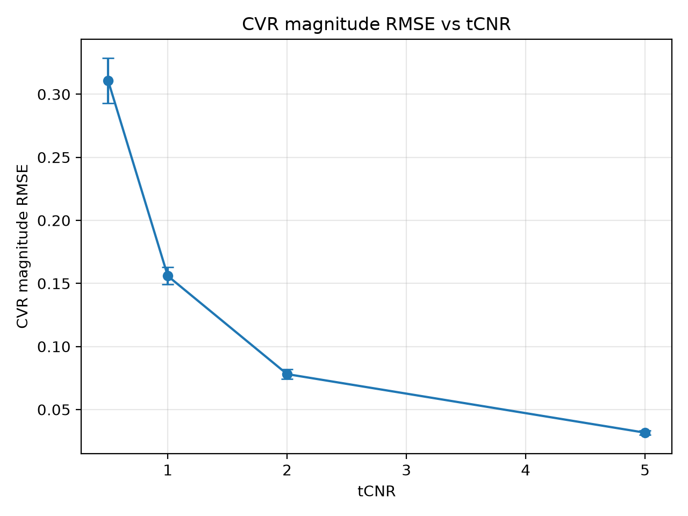
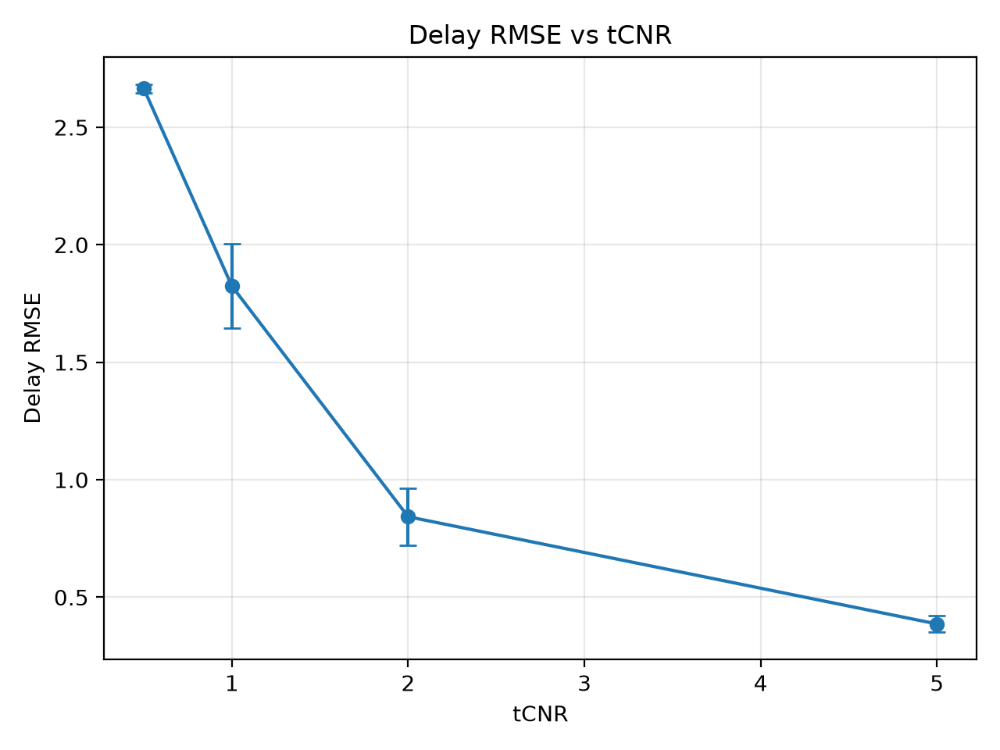

# NeuroCVR-AI Experiment Report

This report summarises the synthetic GLM benchmark sweep for NeuroCVR-AI.

The sweep evaluates how cerebrovascular reactivity magnitude and delay recovery change across temporal contrast-to-noise ratio conditions.

## Experiment setup

The benchmark sweep varies:

- tCNR noise level
- random seed

For each run, the pipeline:

1. Generates synthetic ground-truth CVR magnitude and delay maps.
2. Simulates BOLD-fMRI data from an ETCO2 stimulus.
3. Fits a voxelwise GLM with delay search.
4. Estimates CVR magnitude and delay maps.
5. Compares estimates against synthetic ground truth.
6. Logs parameters and metrics to MLflow.

## Key metrics

The tracked metrics are:

- CVR magnitude RMSE
- CVR magnitude MAE
- CVR magnitude bias
- CVR magnitude PCC
- Delay RMSE
- Delay MAE
- Delay bias
- Delay PCC

## Best CVR magnitude recovery

Best mean CVR RMSE occurred at:

- tCNR: 5.0000
- mean CVR RMSE: 0.0316
- mean CVR PCC: 0.9965

## Best delay recovery

Best mean delay RMSE occurred at:

- tCNR: 5.0000
- mean delay RMSE: 0.3864 s
- mean delay PCC: 0.9843

## Summary table

| tcnr | cvr_rmse_mean | cvr_rmse_std | cvr_mae_mean | cvr_mae_std | cvr_bias_mean | cvr_bias_std | cvr_pcc_mean | cvr_pcc_std | delay_rmse_mean | delay_rmse_std | delay_mae_mean | delay_mae_std | delay_bias_mean | delay_bias_std | delay_pcc_mean | delay_pcc_std |
| --- | --- | --- | --- | --- | --- | --- | --- | --- | --- | --- | --- | --- | --- | --- | --- | --- |
| 0.5 | 0.3107296208305024 | 0.0180595569744117 | 0.2286845862905105 | 0.0178550414607931 | 0.04096535911256 | 0.0352425448010525 | 0.7708935232909102 | 0.0479564593336744 | 2.6652121473335133 | 0.0183832831454789 | 2.063757016879679 | 0.0450100008879489 | 0.1239335658532482 | 0.3115299404162664 | 0.3751809706169165 | 0.1013461276841989 |
| 1.0 | 0.1558880826250071 | 0.0068032694774488 | 0.1146653012453673 | 0.0080097343021498 | 0.0125509520314989 | 0.0171935999218921 | 0.9235781206358376 | 0.0114420876492005 | 1.8241487676426795 | 0.1788329372813584 | 1.3118616235097849 | 0.106105068974725 | 0.0239335658532482 | 0.1516027216883936 | 0.6727083562104679 | 0.0915994310082586 |
| 2.0 | 0.0780882176015696 | 0.0038407180410689 | 0.056978350596509 | 0.0042319204340052 | 0.0026884608135213 | 0.0088827175627915 | 0.9792118463098314 | 0.0024047505820936 | 0.8427175786611881 | 0.12203479850084 | 0.633675225514261 | 0.0835536750112962 | 0.0183780102976926 | 0.0942187978883961 | 0.9258729523387214 | 0.0222879117264756 |
| 5.0 | 0.031648276709161 | 0.0016390093982157 | 0.0230857723862221 | 0.0015786307203939 | 0.000247822725415 | 0.003546012418875 | 0.9965046042298208 | 0.0003306951470193 | 0.3863931669619866 | 0.0338076043404615 | 0.3223215688920069 | 0.038102646037607 | -0.0077222876440202 | 0.0225066880556872 | 0.9843197489668292 | 0.001999660812661 |

## Figures

### CVR magnitude RMSE vs tCNR

### Delay RMSE vs tCNR

## Interpretation

Higher tCNR generally improves CVR magnitude and delay recovery because the simulated BOLD response is less dominated by noise.

Low-tCNR runs are expected to show larger errors and lower correlations, making them useful stress tests for the estimation pipeline.

## Engineering relevance

This report demonstrates:

- experiment tracking with MLflow
- repeatable benchmark sweeps
- CSV export of run-level and summary metrics
- automated report generation
- portfolio-ready visualisation of model behaviour

## Safety and limitations

This project is a research and portfolio prototype.

The reported metrics are based on synthetic data with known ground truth. They should not be interpreted as clinical validation.

This software is not a diagnostic tool and must not be used for patient care.
